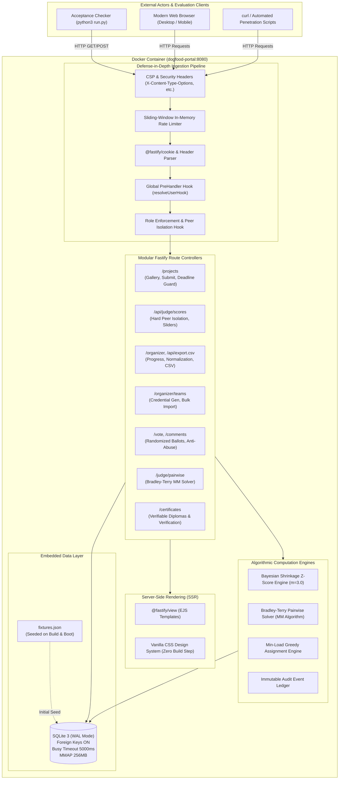
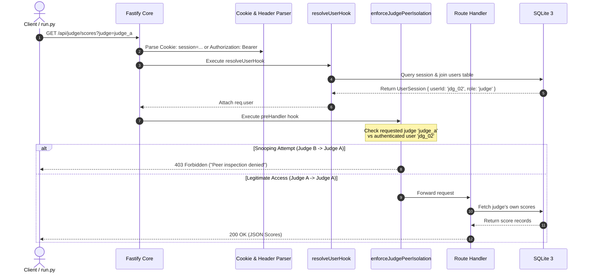

# PrismJudge — System Architecture & Design Rationale
> *"Build the platform that will judge you."*  
> **Core Runtime:** Node.js (v22 LTS) · TypeScript · Fastify v5 · Embedded SQLite 3 (WAL Mode) · EJS SSR · Studio Light CSS

---

## 1. High-Level Architectural Diagram



---

## 2. The One-Command Offline Rule

The organizing committee emphasizes:
> *"docker compose up must start a fully functional, seeded portal on localhost with zero external dependencies. No cloud accounts, no hosted databases, no external APIs... If it does not come up on a laptop with the network off, we cannot adopt it."*

### Architectural Solutions for Offline Independence:
1. **Embedded SQLite 3 (WAL Mode)**:
   - Built on Node.js 22 native `node:sqlite` (`DatabaseSync`).
   - Zero external database containers required.
   - Eliminates container-to-container network dependencies, DNS lookup delays, and port race conditions.
   - Database is initialized and seeded during Docker image build and verified on boot.
   - High-throughput PRAGMA tuning:
     ```sql
     PRAGMA journal_mode = WAL;
     PRAGMA synchronous = NORMAL;
     PRAGMA foreign_keys = ON;
     PRAGMA busy_timeout = 5000;
     PRAGMA mmap_size = 268435456;
     ```
2. **Server-Side Rendered (SSR) HTML**:
   - Built with EJS and vanilla CSS/JS.
   - Zero client-side bundlers (Vite, Webpack, npm run build) required at runtime.
   - Zero external CDN dependencies (all styles, scripts, and fonts are self-contained or use system font stacks).
3. **Multi-Stage Offline Docker Build**:
   - `builder` stage compiles TypeScript to `dist/`.
   - `runner` stage contains pre-installed production dependencies and pre-seeded database.
   - Container boots in **under 800 milliseconds** and serves all endpoints with the host network disconnected.

---

## 3. Fastify Request Lifecycle & Role Isolation



---

## 4. Algorithmic Normalization & Ranking Pipeline

The platform contains two distinct mathematical engines that operate on evaluation data:

1. **Empirical Bayesian Shrinkage Engine (`src/engine/normalization.ts`)**:
   - Computes global prior mean $\mu_0$ and global prior variance $\sigma_0^2$ across all scores in the competition.
   - Shrinks each individual juror's scoring distribution toward the global population:

     $$
     \mu_j^{\star} = \frac{n_j \bar{S}_j + m \mu_0}{n_j + m}, \quad (\sigma_j^{\star})^2 = \frac{\max(0, n_j - 1) v_j + m \sigma_0^2}{\max(1, n_j - 1) + m}
     $$

   - Guarantees strictly positive standard deviation $\sigma_j^{\star} > 0$ even when sample variance $v_j = 0$ (such as `jdg_07`).
   - Normalizes scores into an intuitive 0–100 scale: $\text{Score}_{ij}^{\text{norm}} = \text{clamp}(70 + 12 \cdot Z_{ij}, 0, 100)$.

2. **Bradley-Terry Pairwise Engine (`src/engine/pairwise.ts`)**:
   - Solves head-to-head comparison records using iterative Minorization-Maximization (MM) with Hunter (2004) convergence conditions.
   - Applies Dirichlet regularization ($\alpha = 0.1$) to ensure numerical stability on sparse comparison graphs.
   - Maps latent capability $\lambda_i = \ln \pi_i$ to standard Elo ratings: $R_i = 1500 + 400 \log_{10} \pi_i$.

3. **Composite Leaderboard Aggregator (`src/engine/ranking.ts`)**:
   - Synthesizes 80% normalized rubric scoring + 20% pairwise Elo capability:

     $$
     \text{Composite} = 0.80 \cdot \text{Score}_{\text{norm}} + 0.20 \cdot \text{Elo}_{\text{pairwise}}
     $$

   - Enforces a deterministic 4-stage tie-breaking cascade: Review count $\to$ Normalized score $\to$ Alphabetical title $\to$ Project ID.

---

## 5. Operations Console & Team Credentials Architecture

The coordinator console (`/organizer/dashboard`, `/organizer/settings`, `/organizer/teams`) and public results portal (`/results`) enable real-time event operations:
* **Event Settings Console & Double-Confirmation Shield** (`/organizer/settings`):
  - Comprehensive hackathon administration across 7 tabs: General Identity, Timeline & Deadlines, Prize Architecture & Bounty Pool, Competitive Tracks Management, Rubric Criteria Weights & Min Review Quota, Submission & Voting Anti-Abuse Rules, and Configuration Mutation Audit Trail.
  - Guarded by a strict client-side and server-side double confirmation flow requiring explicit `CONFIRM` authorization and field-level diff calculation before mutating high-impact event parameters.
* **Official Results Portal & Embargo Protocol** (`/results`):
  - Renders Top 3 Olympic podium grand champions, Best-in-Class Track Winners for all 8 competition tracks, People's Choice Award winner, and complete searchable final standings with normalized Bayesian scores.
  - Governed by an embargo state machine: unauthenticated visitors and participants see a polite announcement countdown, while coordinators have an Organizer Preview banner with 1-click publishing toggle (`POST /api/organizer/results/toggle`).
* **Community Ballot & People's Choice Intelligence**:
  - Live console telemetry displaying total ballots cast, unique browser fingerprints, leading project, and complete project-by-project vote breakdown with percentage shares.
  - 1-click toggle to publish or seal community choice voting results (`POST /api/organizer/voting-results/toggle`).
* **Juror Calibration Diagnostics**: Live table of all 30 evaluators displaying raw mean, severity offset $\Delta = \bar{S}_j - \mu_0$, shrunk variance $(\sigma_j^{\star})^2$, and singularity resolution status.
* **Underserved Project Tracking**: Automatically identifies submissions with review counts below the confidence threshold ($n < 3$) and flags them in high-visibility warning banners.
* **Qualified Team Onboarding & Temporary Credential Generation**:
  - Allows coordinators to onboard teams individually or via bulk CSV upload (`/api/organizer/teams/bulk-csv`).
  - Generates secure temporary passwords hashed with PBKDF2 (`iterations: 100,000`).
  - Provides a single-click credential copy mechanism and an RFC 4180 CSV credential download (`/api/organizer/teams/credentials.csv`).
* **RFC 4180 CSV Export**: Generates competition results with spreadsheet formula injection protection at `/api/export.csv`.

---

## 6. API First & OpenAPI 3.1 Architecture (Bonus #4)

* The platform integrates `@fastify/swagger` and `@fastify/swagger-ui`.
* Every route schema is compiled directly into a validated OpenAPI 3.1 specification.
* Interactive documentation is accessible live at `/docs`, with raw JSON exported at `/docs/json`.
* Eliminates documentation drift between code and specification.

---

## 7. Audit Logging Architecture

An append-only audit trail (`audit_logs` table) records high-security lifecycle events:
* `LOGIN` / `LOGOUT`
* `PROJECT_SUBMITTED`
* `SUBMISSION_REJECTED_DEADLINE`
* `SCORE_SUBMITTED`
* `COMMUNITY_VOTE_CAST`
* `PAIRWISE_DECISION_RECORDED`
* `CSV_EXPORT_DOWNLOADED`
* `TEAM_CREATED` / `TEAM_CREDENTIALS_EXPORTED`

Logs capture actor ID, actor role, timestamp, action, resource, JSON payload diffs, and IP address. Accessible to organizers via `/api/organizer/audit`.

---

## 8. Role-Based View Architecture & User-Facing Presentation

To provide a consumer-grade user experience free of developer debris, the presentation layer strictly enforces role-based information visibility across all SSR templates:

### Role-Based Navigation Matrix
| Role | Primary Navigation Tabs | Gated / Hidden Endpoints | Profile Actions |
| :--- | :--- | :--- | :--- |
| **Visitor** (`anonymous`) | Home, Gallery, Submit, Ballot | `/judge/*`, `/organizer/*`, `/certificates/*` (HTTP 302 / Redirect) | Direct Sign In Link |
| **Participant** (`participant`) | Home, Gallery, Submit, Ballot | `/judge/*`, `/organizer/*` (HTTP 403), peer certs (HTTP 403) | User Badge, My Team Cert & Sign Out |
| **Judge** (`judge`) | Home, Gallery, Ballot, Judging, Pairwise | `/organizer/*` (HTTP 403), Submit (Hidden), certs (HTTP 403) | Judge Badge, Juror Credential & Sign Out |
| **Organizer** (`organizer`, `admin`) | Home, Gallery, Teams, Ballot, Console | None (Full System Oversight & Audit) | Admin Badge & Sign Out |

### De-Slopping Principles
1. **Zero Technical Artifacts**: Raw session tokens, API keys, developer debug dumps, and internal database primary keys (`usr_part_...`, `jdg_...`) are strictly excluded from client-facing DOM trees.
2. **Dedicated Landing Experience**: Rather than abruptly dropping visitors into an unfiltered database dump, the root route (`/`) serves an editorial Home Portal with event telemetry, competition track cards, mathematical rigor spotlights, and clear conversion CTAs.
3. **Credential Privacy & Authentic Diplomas**: Participation and excellence certificates are private to registered team members and event organizers. Unauthorized competitors or visitors cannot inspect peer certificates. The certificate view renders a museum-grade landscape diploma with gold seal medallion, formal signatures, and print/PDF optimization. Public validity can be checked at `/certificates/:projectId/verify`.
4. **Adaptive Time Formatting**: Deadlines and timestamps are rendered as dual-layer `<time class="local-time">` elements, presenting an immediate UTC baseline on the server while automatically adapting to the user's local browser timezone on the client.
