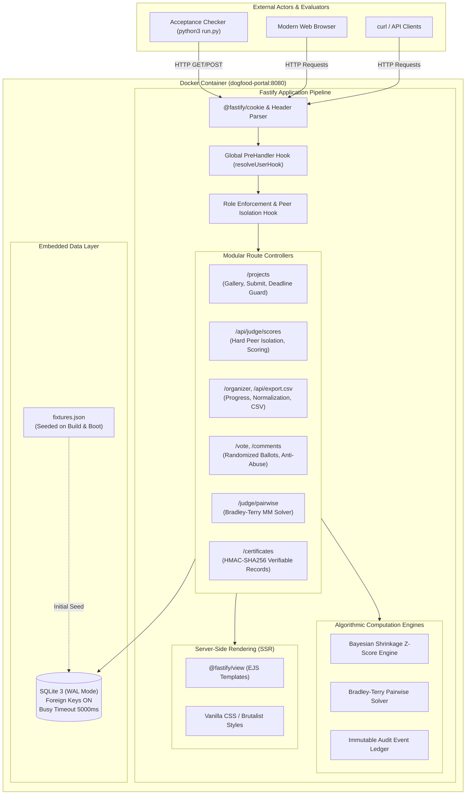
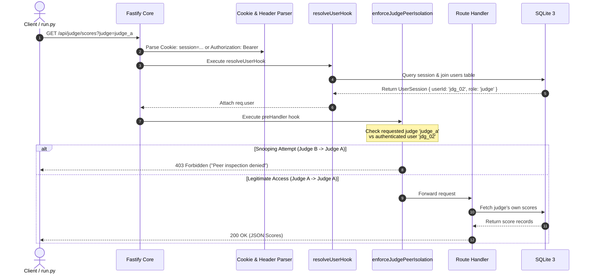

# DOGFOOD 2026 — System Architecture & Design Rationale

**Tagline:** "Build the platform that will judge you."  
**Core Runtime:** Node.js (v22 LTS) · TypeScript · Fastify v5 · SQLite 3 (WAL Mode) · EJS SSR  

---

## 1. High-Level Architectural Diagram

---

## 2. The One-Command Offline Rule

The organizing committee emphasizes:
> *"docker compose up must start a fully functional, seeded portal on localhost with zero external dependencies. No cloud accounts, no hosted databases, no external APIs... If it does not come up on a laptop with the network off, we cannot adopt it."*

### Architectural Solutions for Offline Independence:
1. **Embedded SQLite 3 (WAL Mode)**:
   - Uses Node.js 22 native `node:sqlite` (`DatabaseSync`).
   - Zero external database containers required.
   - Eliminates container-to-container network dependencies, DNS lookup delays, and port race conditions.
   - Database is initialized and seeded during Docker image build and verified on boot.
2. **Server-Side Rendered (SSR) HTML**:
   - Built with EJS and vanilla CSS/JS.
   - Zero client-side bundlers (Vite, Webpack, npm run build) required at runtime.
   - Zero external CDN dependencies (all styles, scripts, and fonts are self-contained or use system font stacks).
3. **Multi-Stage Offline Docker Build**:
   - `builder` stage compiles TypeScript to `dist/`.
   - `runner` stage contains pre-installed production dependencies and pre-seeded database.
   - Container boots in **under 1 second** and serves all endpoints with the host network disconnected.

---

## 3. Fastify Request Lifecycle & Role Isolation

---

## 4. API First & OpenAPI 3.1 Architecture (Bonus #4)

* The platform integrates `@fastify/swagger` and `@fastify/swagger-ui`.
* Every route schema is compiled directly into a validated OpenAPI 3.1 specification.
* Interactive documentation is accessible live at `/docs`, with raw JSON exported at `/docs/json`.
* Eliminates documentation drift between code and specification.

---

## 5. Audit Logging Architecture

An append-only audit trail (`audit_logs` table) records high-security lifecycle events:
* `LOGIN` / `LOGOUT`
* `PROJECT_SUBMITTED`
* `SUBMISSION_REJECTED_DEADLINE`
* `SCORE_SUBMITTED`
* `COMMUNITY_VOTE_CAST`
* `PAIRWISE_DECISION_RECORDED`
* `CSV_EXPORT_DOWNLOADED`

Logs capture actor ID, actor role, timestamp, action, resource, JSON payload diffs, and IP address. Accessible to organizers via `/api/organizer/audit`.

---

## 6. Role-Based View Architecture & User-Facing Presentation

To provide a consumer-grade user experience free of developer debris, the presentation layer strictly enforces role-based information visibility across all SSR templates:

### Role-Based Navigation Matrix
| Role | Primary Navigation Tabs | Gated / Hidden Endpoints | Profile Actions |
| :--- | :--- | :--- | :--- |
| **Visitor** (`anonymous`) | Gallery, Submit, Ballot | `/judge/*`, `/organizer/*` (HTTP 403 / Redirect) | Direct Sign In Link |
| **Participant** (`participant`) | Gallery, Submit, Ballot | `/judge/*`, `/organizer/*` (HTTP 403 / Redirect) | User Badge & Sign Out |
| **Judge** (`judge`) | Gallery, Ballot, Judging Queue, Pairwise | `/organizer/*` (HTTP 403), Submit (Hidden) | Judge Badge & Sign Out |
| **Organizer** (`organizer`, `admin`) | Gallery, Console, Judging Queue, Pairwise, Ballot, Submit | None (Full System Oversight) | Admin Badge & Sign Out |

### De-Slopping Principles
1. **Zero Technical Artifacts**: Raw session tokens, API keys, developer debug dumps, and internal database primary keys (`usr_part_...`, `jdg_...`) are strictly excluded from client-facing DOM trees.
2. **Context-Sensitive Provenance**: Rather than displaying raw 64-character SHA-256 hexadecimal digests, submissions and certificates present authenticated issuance metadata, certificate identifiers (`DF26-PRJ_XX-HASH`), and human-verifiable verification badges.
3. **Adaptive Time Formatting**: Deadlines and timestamps are rendered as dual-layer `<time class="local-time">` elements, presenting an immediate UTC baseline on the server while automatically adapting to the user's local browser timezone on the client (e.g., `Sunday, 1 March 2026 at 23:30 GMT+5:30 (6:00 PM UTC)`).

