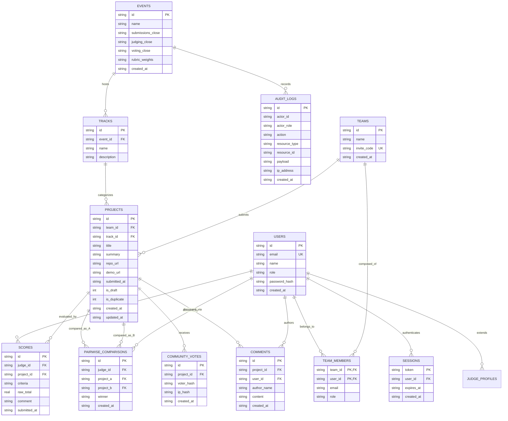

# DOGFOOD 2026 — Data Model & Schema Documentation

**Platform:** Embedded SQLite 3 (WAL Mode, Foreign Keys Enforced)  
**ORM / Data Layer:** Parameterized Prepared Statements via `node:sqlite` / `better-sqlite3`  
**Ingestion Source:** `fixtures.json` (41 projects, 30 judges, 40 teams, 8 tracks, 126 scores)  

---

## 1. Entity-Relationship Diagram



---

## 2. Table Specifications & Constraints

### 2.1 `events`
Stores hackathon configuration, lifecycle timestamps, and default rubric weights.
* `id` (`TEXT PRIMARY KEY`): Unique event identifier (e.g. `evt_01`).
* `name` (`TEXT NOT NULL`): Event title.
* `submissions_close` (`TEXT NOT NULL`): ISO 8601 UTC timestamp enforced by backend submission routes.
* `judging_close` (`TEXT`): When judge scoring is locked.
* `voting_close` (`TEXT`): When community voting concludes and results are unmasked.
* `rubric_weights` (`TEXT NOT NULL DEFAULT '{"functionality": 0.4, "quality": 0.3, "innovation": 0.3}'`): JSON representation of criterion weights.
* `created_at` (`TEXT NOT NULL`): Creation timestamp.

### 2.2 `users` & `sessions`
RBAC foundation supporting 5 roles: `visitor`, `participant`, `judge`, `organizer`, `admin`.
* `users.id` (`TEXT PRIMARY KEY`): Unique user ID (e.g. `usr_org`, `jdg_01`).
* `users.email` (`TEXT UNIQUE NOT NULL`): User email.
* `users.role` (`TEXT NOT NULL CHECK(role IN ('visitor', 'participant', 'judge', 'organizer', 'admin'))`).
* `sessions.token` (`TEXT PRIMARY KEY`): Cryptographic or seeded session token (e.g. `org_7f2a`).
* `sessions.user_id` (`TEXT NOT NULL REFERENCES users(id) ON DELETE CASCADE`).
* `sessions.expires_at` (`TEXT NOT NULL`): Expiry timestamp verified on each request.

### 2.3 `teams` & `team_members`
Team formation and invite code management.
* `teams.id` (`TEXT PRIMARY KEY`): e.g. `tm_01`.
* `teams.invite_code` (`TEXT UNIQUE NOT NULL`): e.g. `inv_tm_01`.
* `team_members.PRIMARY KEY (team_id, user_id)`: Composite key preventing duplicate membership.

### 2.4 `projects`
Hackathon project entries, revisions, and duplicate tracking.
* `id` (`TEXT PRIMARY KEY`): e.g. `prj_01`.
* `team_id` (`TEXT NOT NULL REFERENCES teams(id)`).
* `track_id` (`TEXT NOT NULL REFERENCES tracks(id)`).
* `is_draft` (`INTEGER NOT NULL DEFAULT 0`): Flag for unsubmitted drafts.
* `is_duplicate` (`INTEGER NOT NULL DEFAULT 0`): Flag for multi-submission edge cases.

### 2.5 `scores`
Individual judge evaluations against the multi-criteria rubric.
* `id` (`TEXT PRIMARY KEY`): e.g. `sc_jdg_01_prj_01`.
* `judge_id` (`TEXT NOT NULL REFERENCES users(id)`).
* `project_id` (`TEXT NOT NULL REFERENCES projects(id)`).
* `criteria` (`TEXT NOT NULL`): JSON mapping criterion names to integer ratings (1–5).
* `raw_total` (`REAL NOT NULL`): Computed weighted sum.
* `UNIQUE(judge_id, project_id)`: Constraint enforcing at most one active score per judge-project pair.

---

## 3. Fixture Ingestion & Edge Case Handling

The `fixtures.json` challenge file contains real-world edge cases intentionally designed to test data resilience:

| Edge Case in `fixtures.json` | Manifestation in Fixtures | Ingestion Strategy & Resolution |
| :--- | :--- | :--- |
| **Duplicate Submission** | `tm_07` submitted both `prj_07` (04:29 UTC) and `prj_41` (17:57 UTC), both titled *"Dry Harbour"*. | `src/db/seed.ts` tracks teams seen; ingests both records, but marks the later revision `prj_41` with `is_duplicate = 1`. Both remain addressable, but the duplicate is accounted for in aggregation. |
| **Zero-Variance Judge** | Judge `jdg_07` scored 3 projects giving identical scores of `4` across all criteria ($\sigma = 0$). | Standard Z-score division ($z = \frac{x-\mu}{\sigma}$) produces `ZeroDivisionError`. Handled via Empirical Bayesian Shrinkage with pseudo-observation prior $m=3.0$, yielding $\sigma_{\text{shrunk}} = 0.5105 > 0$. |
| **Asymmetric Review Counts** | Projects have varying review counts (between 2 and 5 reviews per project). | Normalization rescales individual reviews relative to judge tendencies prior to taking the project mean, preventing unreviewed penalty. |
| **Unfinished Batches** | Some judges did not finish reviewing all assigned projects. | Left joins preserve project integrity; organizer dashboard explicitly flags projects with $<3$ reviews. |

---

## 4. Export Formats & Schemas

### 4.1 CSV Export (`GET /api/export.csv`)
Streams `text/csv` with RFC 4180 compliance:
```csv
rank,project_id,title,team_id,track_id,review_count,raw_average,normalized_score,composite_score
1,prj_34,"Iron Switch",tm_34,trk_08,3,4.367,84.074,81.259
2,prj_11,"Salt Ledger",tm_11,trk_02,4,4.375,81.340,79.072
3,prj_33,"Slow Trail",tm_33,trk_01,3,4.033,79.870,77.896
```

### 4.2 JSON API (`GET /api/projects?format=json`)
Returns full normalized project records for programmatic integration.
