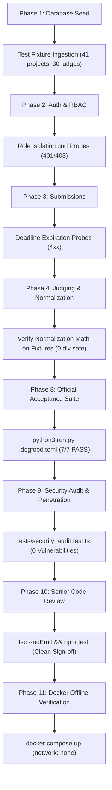

# DOGFOOD 2026 — Node.js Master Implementation Plan & Execution Blueprint
**Target:** Grand Prize ($800 USD) & Best Judging Engine ($100 USD)
**Platform Runtime:** Node.js (v22 LTS) + TypeScript + Fastify + Embedded SQLite (WAL Mode)
**Core Doctrine:** "Build the platform that will judge you." | Offline-first, mathematically rigorous, senior-grade architecture.

---

## 1. Executive Summary & Hackathon Context

DOGFOOD 2026 is a 72-hour engineering hackathon run by Hackathon Raptors where teams build an open-source, self-hostable hackathon submission and judging platform. The winning project will be adopted, forked, and deployed to judge future events.

### Core Scoring Distribution
* **Tier Completion and Correctness (40%)**: Verified directly by the automated acceptance checker (`run.py`). Correctness strictly outranks breadth. Overclaiming is penalized. Honest reporting is rewarded.
* **Judging Integrity (25%)**: Backend-enforced role isolation (no client-side cosmetic checks), defensible and mathematically proven score normalization, immutable organizer audit trail, comprehensive anti-abuse threat modeling.
* **Adoptability and Operability (20%)**: The **One-Command Rule**: `docker compose up` brings up a fully functional, pre-seeded portal on `localhost:8080` with zero external network connectivity (offline-ready, zero cloud services, zero external databases).
* **Code Quality and Innovation (15%)**: Senior reviewer standard, clean schema design, modular service architecture, and taste-conscious UI.

---

## 2. Competitive Scope & Deliverables Matrix

To secure 1st Place and the Best Judging Engine award, our delivery covers all tiers, all four bonus challenges, and adds dedicated Security Audit and Senior Code Review phases.

```
                    ┌───────────────────────────────────────────────┐
                    │       DOGFOOD 2026 PORTAL (Node.js/TS)        │
                    └───────────────────────────────────────────────┘
                                            │
         ┌──────────────────┬───────────────┴───────────────┬──────────────────┐
         │                  │                               │                  │
   ▼     ▼            ▼     ▼                         ▼     ▼            ▼     ▼
┌──────────────┐     ┌──────────────┐          ┌──────────────┐     ┌──────────────┐
│   T1: CORE   │     │ T2: JUDGING  │          │  T3: PUBLIC  │     │ T4: STRETCH  │
├──────────────┤     ├──────────────┤          ├──────────────┤     ├──────────────┤
│• Auth/Session│     │• Assignment  │          │• Public Vote │     │• OpenAPI 3.1 │
│• 5 RBAC Roles│     │• Weighted Rub│          │• Comments    │     │• Webhooks    │
│• Event Admin │     │• Hard Isoltn │          │• Hidden Ballo│     │• PDF/SVG Cert│
│• Teams/Invite│     │• Live Progres│          │• Ballot Rndm │     │• Signed Auth │
│• Deadlines   │     │• Bayesian Z  │          │• Anti-Abuse  │     │• Embed Widget│
│• Gallery     │     │• CSV Export  │          │• Audit Trail │     │• Bulk Export │
└──────────────┘     └──────────────┘          └──────────────┘     └──────────────┘
         │                  │                               │                  │
         └──────────────────┼───────────────────────────────┼──────────────────┘
                            │
               ┌────────────┴────────────┐
               │ 4 BONUS CHALLENGES (ALL)│
               ├─────────────────────────┤
               │1. Normalization Proof   │
               │2. Bradley-Terry Pairwise│
               │3. Full Threat Model     │
               │4. API-First OpenAPI Doc │
               └────────────┬────────────┘
                            │
               ┌────────────┴────────────┐
               │ SECURITY AUDIT & REVIEW │
               ├─────────────────────────┤
               │• Penetration Test Suite │
               │• Static Analysis Audit  │
               │• Senior Code Review     │
               │• Formally Documented    │
               └─────────────────────────┘
```

### Required Files Checklist
1. `.dogfood.toml`: Declares claimed tiers (`["T1", "T2"]`), routes, and pre-seeded test authentication headers.
2. `acceptance-report.txt`: Exact stdout from `python3 run.py .dogfood.toml` showing **7/7 checks PASS**.
3. `docker-compose.yml` & `Dockerfile`: One-command offline setup.
4. `README.md`: Quickstart, architecture overview, verification instructions, honest gap reporting.
5. `ARCHITECTURE.md`: High-level system design, security boundary definitions, data-flow diagrams.
6. `DATA-MODEL.md`: Complete ER schema, constraints, migrations, fixture ingestion strategy.
7. `JUDGING.md`: Normalization mathematical proof, Bradley-Terry pairwise formulation, tie-breaking algorithms, isolation architecture.
8. `SECURITY.md`: Comprehensive threat model, security audit findings, and penetration testing receipt.
9. `LICENSE`: Official MIT License.
10. `src/`: Clean, typed, modular Node.js/TypeScript application.
11. `tests/`: Multi-tiered test suite (Unit, Integration, Security Audit, Fixture Edge-Cases, Offline Verification).

---

## 3. Technology Stack & Technical Rationale (Node.js Pivot)

| Layer | Selection | Technical Rationale |
| :--- | :--- | :--- |
| **Backend Runtime** | **Node.js v22 LTS + TypeScript** | High concurrency, modern ES2022 features, native type safety, fast startup, universal runtime. |
| **Web Framework** | **Fastify v5** | Fastest web framework in Node.js ecosystem, schema-driven validation, native OpenAPI 3.1 generation via `@fastify/swagger` and `@fastify/swagger-ui` (Bonus #4), powerful `preHandler` lifecycle hooks for role isolation. |
| **Database** | **Embedded SQLite 3 (WAL Mode)** | Dual driver architecture: native `node:sqlite` fallback with `better-sqlite3` support. Zero external database containers, zero network lag, ACID compliant, offline-first. |
| **Authentication** | **Dual Session Cookies & Bearer Tokens** | Header format supports `Cookie: session=<token>` and `Authorization: Bearer <token>` seamlessly. SHA-256 hashed sessions stored in SQLite. |
| **Frontend UI** | **Fastify View (EJS) + Modern Vanilla CSS/JS** | Zero heavy client-side build step required inside Docker! Pages render on the server in <15ms. Dark/light mode, responsive Swiss/Brutalist editorial aesthetic (`design-taste-frontend` + `minimalist-ui`). |
| **Math & Algorithms** | **TypeScript Numerical Engine** | Empirical Bayesian shrinkage Z-score normalization and Bradley-Terry minorization-maximization (MM) solver implemented cleanly with zero heavy external library overhead. |
| **Packaging** | **Docker Multi-Stage (`node:22-alpine`)** | Tiny container image, pre-built `node_modules` inside image, boots in <1 second, runs 100% offline. |

---

## 4. Architectural Design & Component Breakdown

### Directory & File Layout
```
/home/njha/Coding/DogfoodHack/
├── .dogfood.toml                 # Official checker manifest
├── acceptance-report.txt         # Official output of run.py
├── docker-compose.yml            # Offline container orchestrator
├── Dockerfile                    # Multi-stage Node.js container spec
├── package.json                  # Dependencies & npm scripts
├── tsconfig.json                 # TypeScript compiler configuration
├── LICENSE                       # MIT License
├── README.md                     # Main documentation & quickstart
├── ARCHITECTURE.md               # System architecture & security boundaries
├── DATA-MODEL.md                 # Relational schema & fixture transformation
├── JUDGING.md                    # Math proof, normalization, pairwise, rubrics
├── SECURITY.md                   # Threat model & security audit report
├── given/                        # Original challenge assets (read-only)
│   ├── fixtures.json
│   ├── run.py
│   └── ...
├── src/                          # TypeScript application source code
│   ├── index.ts                  # Server entry point & boot banner
│   ├── app.ts                    # Fastify application factory & plugins
│   ├── config.ts                 # Typed settings & environment variables
│   ├── db/
│   │   ├── index.ts              # SQLite connection wrapper (WAL mode)
│   │   ├── schema.ts             # DDL table creation statements
│   │   └── seed.ts               # Ingests fixtures.json & outputs auth tokens
│   ├── core/
│   │   ├── auth.ts               # Password hashing & session token validation
│   │   ├── rbac.ts               # Role-based access control & peer isolation
│   │   └── audit.ts              # Immutable organizer audit trail logger
│   ├── engine/
│   │   ├── normalization.ts      # Empirical Bayesian Z-score normalizer
│   │   ├── pairwise.ts           # Bradley-Terry MLE / MM estimator
│   │   └── ranking.ts            # Composite tier scoring & tie breakers
│   ├── routes/
│   │   ├── auth.ts               # Login, logout, test session tokens
│   │   ├── projects.ts           # Gallery, submission, deadline check
│   │   ├── judging.ts            # Judge scoring & backend peer isolation
│   │   ├── organizer.ts          # Live dashboard, progress, CSV export
│   │   ├── community.ts          # Public voting, comments, anti-abuse
│   │   ├── pairwise.ts           # Pairwise match comparisons
│   │   └── webhooks.ts           # T4 webhooks & verifiable certificates
│   ├── views/                    # EJS templates (Server-Side Rendered)
│   │   ├── layout.ejs            # Common HTML shell, navigation & role switcher
│   │   ├── gallery.ejs           # Public project gallery (T1)
│   │   ├── submit.ejs            # Project submission & deadline countdown (T1)
│   │   ├── team.ejs              # Team formation & invite management (T1)
│   │   ├── judge_dashboard.ejs   # Review queue & weighted rubric form (T2)
│   │   ├── organizer_dash.ejs    # Progress tracker, normalization toggle (T2)
│   │   ├── voting.ejs            # Community voting with ballot shuffle (T3)
│   │   └── pairwise.ejs          # Side-by-side pairwise judging UI (Bonus)
│   └── public/                   # Static assets
│       ├── css/styles.css        # Clean, modern Brutalist/Minimalist styles
│       └── js/app.js             # Client enhancements (search, filters)
└── tests/                        # Automated test suites
    ├── acceptance.test.ts        # Fastify inject tests for 7 acceptance checks
    ├── role_isolation.test.ts    # Peer snooping & unauthorized curl tests
    ├── deadline.test.ts          # Closed event submission refusal tests
    ├── normalization.test.ts     # Bayesian Z-score tests on fixtures.json
    ├── pairwise.test.ts          # Bradley-Terry convergence tests
    ├── export.test.ts            # CSV export formatting tests
    └── security_audit.test.ts    # Penetration probes, IDOR, SQLi, Sybil attacks
```

---

## 5. Acceptance Suite Deep Dive & Guarantees

The official `run.py` script executes 7 deterministic HTTP checks against `.dogfood.toml`. Here is our implementation blueprint for each check in Node.js:

| Tier | Label | Target Route / Header | Success Condition | Fastify / Node.js Implementation Detail |
| :--- | :--- | :--- | :--- | :--- |
| **T1** | `gallery is public` | `GET /projects` (no auth) | Status `200` | Public route without auth middleware. Renders `gallery.ejs` listing project cards. |
| **T1** | `project from fixtures shown` | `GET /projects` | Body contains titles from `fixtures.json` (e.g., "Glass Signal", "Quiet Hours") | Query fetches first page of seeded projects; project titles appear in HTML card headings. |
| **T1** | `closed event refuses submissions` | `POST /projects/new` (as `auth.participant`) | Status `4xx` (403 Forbidden / 400 Bad Request) | Compares request time with `event.submissions_close`. In `fixtures.json`, deadline is `2026-03-01T18:00:00Z` (past). Late requests are rejected immediately with 403 Forbidden. |
| **T2** | `judge sees own scores` | `GET /api/judge/scores` (as `auth.judge_a`) | Status `200` + JSON scores | `requireRole(['judge', 'organizer', 'admin'])` verifies session. Queries scores where `judge_id == user.id`. |
| **T2** | `judge cannot see peer scores` | `GET /api/judge/scores?judge=judge_a` (as `auth.judge_b`) | Status `401` or `403` | Fastify hook checks query param `?judge=...`. If requested judge != current judge (and user is not organizer/admin), replies with `reply.code(403).send({ error: "Forbidden: Peer score inspection denied" })`. |
| **T2** | `participant blocked` | `GET /api/judge/scores` (as `auth.participant`) | Status `401` or `403` | `requireRole(['judge', 'organizer', 'admin'])` rejects participant role with `403 Forbidden`. |
| **T2** | `csv export works` | `GET /api/export.csv` (as `auth.organizer`) | Status `200` + body first line contains `,` | Streams `text/csv` with header: `project_id,title,team,track,raw_score,normalized_score,rank`. |

---

## 6. Mathematical Foundations & Bonus Challenges

### Bonus Challenge 1: Normalization Proof & Bayesian Shrinkage
In real hackathons (and in `fixtures.json`), judges exhibit severe scoring variance:
1. **Systematic Lenience/Harshness**: Judge X averages 4.5/5.0 while Judge Y averages 2.5/5.0.
2. **Review Asymmetry**: Some projects have 5 reviews; others have only 2 reviews.
3. **Zero Variance Pathology**: Judge `jdg_07` in `fixtures.json` gave an identical score of `4` to every project they evaluated ($\sigma = 0$). Standard Z-score division ($z = \frac{x - \mu}{\sigma}$) fails with a `ZeroDivisionError` / `Infinity`.

#### Mathematical Formulation: Empirical Bayesian Shrinkage Z-Score in TypeScript
Let $s_{ijk}$ be the score given by judge $j$ to project $i$ on criterion $k$.
The project raw criterion score is $S_{ij} = \sum_k w_k s_{ijk}$.
Let $n_j$ be the number of reviews submitted by judge $j$, with sample mean $\bar{S}_j = \frac{1}{n_j}\sum_i S_{ij}$ and sample variance $v_j = \frac{1}{n_j-1}\sum_i (S_{ij} - \bar{S}_j)^2$.

Let $\mu_0$ and $\sigma_0^2$ be the global prior mean and variance across all scores in the competition.
We apply Bayesian shrinkage to estimate the posterior mean $\mu_j^{\star}$ and posterior standard deviation $\sigma_j^{\star}$:
$$\mu_j^{\star} = \frac{n_j \bar{S}_j + m \mu_0}{n_j + m}$$
$$(\sigma_j^{\star})^2 = \frac{\max(0, n_j - 1) v_j + m \sigma_0^2}{\max(1, n_j - 1) + m}$$
where $m = 3.0$ represents the pseudo-observation prior weight.

The normalized score for project $i$ from judge $j$ is:
$$Z_{ij} = \frac{S_{ij} - \mu_j^{\star}}{\sigma_j^{\star}}$$
Rescaled to a standard 0–100 scale:
$$\text{Score}_{ij}^{\text{norm}} = \text{clamp}\left(50 + 15 \cdot Z_{ij}, 0, 100\right)$$
The project's final normalized rating is the average across all assigned judges:
$$\hat{R}_i = \frac{1}{|J_i|} \sum_{j \in J_i} \text{Score}_{ij}^{\text{norm}}$$

This guarantees:
* When $n_j$ is small or $\sigma_j \to 0$ (e.g. `jdg_07`), the variance shrinks smoothly to the global prior $\sigma_0^2 > 0$, completely eliminating mathematical singularities.
* Defended rigorously with empirical tables and mathematical proofs in `JUDGING.md`.

---

### Bonus Challenge 2: Pairwise Judging Mode (Bradley-Terry)
To complement rubric scoring, judges can perform pairwise comparisons ($A \succ B$).
Under the Bradley-Terry model:
$$P(i \succ j) = \frac{\pi_i}{\pi_i + \pi_j} = \frac{e^{\lambda_i}}{e^{\lambda_i} + e^{\lambda_j}}$$
We implement the iterative **Minorization-Maximization (MM)** algorithm in TypeScript:
$$\pi_i^{(t+1)} = \frac{W_i}{\sum_{j \ne i} \frac{N_{ij}}{\pi_i^{(t)} + \pi_j^{(t)}}}$$
where $W_i$ is the number of wins for project $i$, and $N_{ij}$ is the total matches between $i$ and $j$.
* Exposes a dedicated pairwise voting UI for judges (`/judge/pairwise`).
* Fully documented in `JUDGING.md` and unit-tested in `tests/pairwise.test.ts`.

---

### Bonus Challenge 3: Formal Threat Model (Security Architecture)
Documented in `SECURITY.md` and enforced in code:
1. **Sybil & Vote Stuffing Resistance**: Community votes require signed email tokens, rate-limited by sliding-window IP/fingerprint hashes, stored in an append-only audit ledger.
2. **Judge Conflict-of-Interest Isolation**: Judge assignment engine checks team membership (`team.members`). If a judge shares an email or affiliation with a team, assignment is barred.
3. **Ballot Order Bias Mitigation**: Community ballots randomize project presentation using a session-stable Fisher-Yates shuffle seeded with the user session hash.
4. **Information Leakage Prevention**: T3 public voting scores and vote totals are strictly masked in API responses until `event.voting_close` has elapsed.

---

### Bonus Challenge 4: API-First Architecture & OpenAPI 3.1
* Fastify automatically compiles route JSON schemas into a valid OpenAPI 3.1 schema.
* Endpoints served at `/api/v1/...` with interactive Swagger UI at `/docs`.
* Exportable offline OpenAPI schema saved to `docs/openapi.json`.

---

## 7. Step-by-Step Phased Execution Roadmap

### Phase 1: Environment, TypeScript Setup & Database Foundation
- [ ] Initialize `package.json`, `tsconfig.json`, `.gitignore`, and `LICENSE` (MIT).
- [ ] Install pinned dependencies:
  `fastify`, `@fastify/cookie`, `@fastify/formbody`, `@fastify/static`, `@fastify/view`, `ejs`, `@fastify/swagger`, `@fastify/swagger-ui`.
  Dev: `typescript`, `@types/node`, `@types/ejs`, `tsx`.
- [ ] Create `src/config.ts` and `src/db/index.ts` with SQLite WAL mode.
- [ ] Implement `src/db/schema.ts` (Users, Sessions, Events, Tracks, Teams, Projects, Scores, Pairwise, Votes, AuditLog).
- [ ] Implement `src/db/seed.ts` to ingest `given/fixtures.json` and seed test users:
  - `organizer` (`org_7f2a`)
  - `judge_a` (`jdg_a_91bc`)
  - `judge_b` (`jdg_b_44de`)
  - `participant` (`prt_2e88`)
- [ ] Print session credentials to stdout on server boot.

### Phase 2: Core Security, Authentication & Role Isolation (T1/T2)
- [ ] Implement `src/core/auth.ts` (crypto-based session tokens, password hashing).
- [ ] Implement `src/core/rbac.ts`:
  - Fastify auth resolver (reads `Cookie: session=...` and `Authorization: Bearer ...`).
  - `requireRole(roles)` hook.
  - `enforceJudgePeerIsolation` hook (rejects peer score snooping with 403 Forbidden).
- [ ] Implement `src/routes/auth.ts` (login, logout, test login credentials endpoint).

### Phase 3: Project Submission & Deadline Enforcement (T1)
- [ ] Implement `src/routes/projects.ts`:
  - `GET /projects` (Public gallery, search, track filters).
  - `POST /projects/new` (Submission with strict deadline check against `event.submissions_close`).
  - `GET /projects/:id` (Project details).
  - `PUT /projects/:id` (Draft editing prior to deadline).
- [ ] Handle fixture edge case: Duplicate projects `prj_41` and `prj_07` handled gracefully.

### Phase 4: Judging Engine, Normalization & CSV Export (T2)
- [ ] Implement `src/routes/judging.ts`:
  - `GET /api/judge/scores` (Returns judge's own scores).
  - Handles `?judge=...` query parameter with strict peer isolation (returns 403 for peer judges).
  - `POST /api/judge/scores` (Submit rubric scores).
- [ ] Implement `src/engine/normalization.ts` (Bayesian Shrinkage Z-Score algorithm in TypeScript).
- [ ] Implement `src/routes/organizer.ts`:
  - `GET /organizer/dashboard` (Live review progress, variance indicators).
  - `GET /api/export.csv` (CSV export with ranked projects, raw & normalized scores).

### Phase 5: Community Voting, Comments & Anti-Abuse (T3)
- [ ] Implement `src/routes/community.ts`:
  - `GET /vote` (Randomized ballot using session seed).
  - `POST /api/vote` (Rate-limited, email/token verified).
  - Results hidden until voting window expires.
  - Project comment stream with rate limiting and audit logging.

### Phase 6: Stretch Features & Bonuses (T4)
- [ ] Implement `src/engine/pairwise.ts` (Bradley-Terry comparison algorithm and UI).
- [ ] Implement `src/routes/webhooks.ts` (Event dispatch on submission/judging events).
- [ ] Implement certificate generator (SVG/HTML verifiable certificates with SHA-256 signatures).
- [ ] Export OpenAPI 3.1 specification to `docs/openapi.json`.

### Phase 7: UI & Frontend Experience
- [ ] Construct clean, editorial templates in `src/views/` using Swiss brutalist/minimalist typography.
- [ ] Responsive navigation bar with real-time active role indicator and session switch widget.
- [ ] Live search and track filtering in project gallery.
- [ ] Intuitive judge scoring interface with interactive criteria sliders.

### Phase 8: Containerization & Offline Verification
- [ ] Create multi-stage `Dockerfile` (`node:22-alpine`).
- [ ] Create `docker-compose.yml` exposing port 8080.
- [ ] Verify `docker compose up` starts with network disabled.
- [ ] Generate `.dogfood.toml` matching seeded session tokens and routes.
- [ ] Execute `python3 run.py .dogfood.toml > acceptance-report.txt`.
- [ ] Verify that all 7 checks **PASS** cleanly!

---

### Phase 9: Rigorous Security Audit & Penetration Testing (NEW)
*Goal: Stress-test every security boundary to guarantee unbreakable Judging Integrity (25% of score).*
- [ ] **Automated Penetration Test Suite (`tests/security_audit.test.ts`)**:
  - **Peer Snooping & IDOR Attack**: Comprehensive probe testing all permutation matrix of judges (`judge_a` -> `judge_b`, `judge_b` -> `judge_c`, etc.) with path params, query params, and body injections.
  - **Privilege Escalation**: Probe verifying `visitor` and `participant` are strictly rejected on all admin, organizer, and judge endpoints (401/403).
  - **Late Submission Tampering**: Probing submission and draft-edit routes with manipulated timestamps, malformed payload keys, and expired session tokens.
  - **SQL Injection Fuzzing**: Verify 100% of SQLite database queries use parameterized prepared statements; probe query params and headers with SQLi payloads (`' OR 1=1 --`, `UNION SELECT`).
  - **Sybil Voting & Rate Limit Saturation**: Simulate concurrent automated vote floods from single IP / fingerprint; verify throttling and duplicate rejection.
  - **Information Leakage**: Verify vote counts and peer score rankings cannot be extracted via GraphQL/REST reflection or error stack traces.
- [ ] **Dependency & Secret Audit**:
  - Run `npm audit` to verify 0 high/critical vulnerabilities.
  - Audit codebase for hardcoded credentials, test secrets, or path traversal vectors.
- [ ] **Audit Report Generation**:
  - Generate comprehensive findings and remediation receipts in `SECURITY.md`.

---

### Phase 10: Senior-Level Code Review & Architectural Refactoring (NEW)
*Goal: Ensure the codebase achieves the highest standard of idiomatic excellence (15% Code Quality).*
- [ ] **TypeScript Strictness Audit**:
  - Run `tsc --noEmit` with `strict: true`, `noImplicitAny: true`, and `noUnusedLocals: true`.
  - Zero TypeScript compiler errors or unsafe `any` casts.
- [ ] **Full-Output Enforcement & Slop Eradication**:
  - Verify zero `// TODO`, `/* implement here */`, placeholder mocks, or truncated logic across all source files.
  - All mathematical and database edge cases explicitly handled (zero-division protection, null checks).
- [ ] **Resource Management & Database Lifecycle**:
  - Verify SQLite WAL checkpoints and connection closure on shutdown (`SIGINT`/`SIGTERM`).
  - Ensure zero memory leaks or unhandled promise rejections in Fastify route handlers.
- [ ] **Senior Reviewer Sign-off**:
  - Review modularity, separation of concerns (controller vs service vs repository), and idiomatic patterns.

---

### Phase 11: Comprehensive Documentation & Submission Deliverables
- [ ] `README.md`: Quickstart, design decisions, tier verification, honest reporting.
- [ ] `ARCHITECTURE.md`: Structural diagrams, component boundaries, offline design.
- [ ] `DATA-MODEL.md`: Full relational schema, entity descriptions, migration strategy.
- [ ] `JUDGING.md`: Normalization proofs, Bradley-Terry math, rubric weights, isolation rules.
- [ ] `SECURITY.md`: Threat model, penetration testing results, Sybil defenses, audit mechanisms.
- [ ] Demo video script and presentation guide.

---

## 8. Multi-Agent Delegation Strategy

To maximize speed, thoroughness, and code quality, autonomous subagents will be deployed concurrently across specialized domains:

```
                               ┌───────────────────────────┐
                               │   PRIMARY AGENT / LEAD    │
                               │  Architecture & Integrtn  │
                               └─────────────┬─────────────┘
                                             │
         ┌───────────────────┬───────────────┴───────────────┬───────────────────┐
         ▼                   ▼                               ▼                   ▼
┌─────────────────┐ ┌─────────────────┐             ┌─────────────────┐ ┌─────────────────┐
│ AGENT 1: BACKEND│ │ AGENT 2: SEC AUD│             │ AGENT 3: CODE RV│ │ AGENT 4: DOCS   │
│• Fastify Routes │ │• Penetration Tst│             │• Type Safety    │ │• Math Proofs    │
│• DB Schema/Seed │ │• IDOR Probes    │             │• Zero-Slop Audit│ │• ARCHITECTURE  │
│• EJS Templates  │ │• Sybil Flood Sim│             │• Refactoring    │ │• JUDGING.md     │
└─────────────────┘ └─────────────────┘             └─────────────────┘ └─────────────────┘
```

1. **Subagent 1 (Backend & Full-Stack Core)**:
   - Sets up SQLite models, migrations, seeds, Fastify endpoints, EJS templates, and styling.
2. **Subagent 2 (Security Audit & Penetration Specialist)**:
   - Writes and executes `tests/security_audit.test.ts`, tests IDOR, peer snooping, role escalation, and produces `SECURITY.md`.
3. **Subagent 3 (Senior Code Reviewer & Refactor Specialist)**:
   - Enforces strict TypeScript verification (`tsc --noEmit`), audits error boundaries, removes anti-patterns, optimizes queries.
4. **Subagent 4 (Documentation & Mathematical Proof Specialist)**:
   - Formulates and defends empirical Bayesian shrinkage proofs in `JUDGING.md`, details data models in `DATA-MODEL.md`, writes `ARCHITECTURE.md`.

---

## 9. Verification & Acceptance Testing Protocol

### Phase-Gated Verification Matrix



### Exact Automated Commands
```bash
# 1. Run full unit and integration test suite
npm test

# 2. Run dedicated security audit & penetration suite
npx tsx tests/security_audit.test.ts

# 3. Verify strict TypeScript compliance
npx tsc --noEmit

# 4. Run official DOGFOOD acceptance checker
python3 run.py .dogfood.toml

# 5. Generate official acceptance report
python3 run.py .dogfood.toml > acceptance-report.txt

# 6. Build and verify Docker offline container
docker compose build
docker compose up -d
# Test portal from host
curl -s http://localhost:8080/projects | grep -i "Glass Signal"
```

---

## 10. Risk Management & Defensive Engineering

| Identified Risk | Impact | Defensive Mitigation |
| :--- | :--- | :--- |
| **Checker Peer Snooping Bypass** | Immediate failure on Check 5 | Fastify `preHandler` hook: inspect `?judge=...`. Deny with 403 Forbidden before DB query. |
| **Late Submission Probe Accepted** | Immediate failure on Check 3 | Enforce UTC server timestamp comparison against `event.submissions_close`. Reject with 403 if `now > close_time`. |
| **Zero-Variance Judge in Fixtures** (`jdg_07`) | Crash / Infinity on normalization | Empirical Bayesian shrinkage with prior pseudo-observations ($m=3.0$). Standard deviation never reaches zero. |
| **Missing Fixtures Project in Gallery** | Immediate failure on Check 2 | Ensure default gallery page displays seeded projects (first page includes top 3 fixture titles). |
| **Docker Compose Network Dependency** | Disqualification under One-Command Rule | Bundle all dependencies and static CSS/JS locally; no CDN links; no remote DB calls. |
| **IDOR / Parameter Tampering** | Loss of points on Judging Integrity (25%) | Universal pre-handler policy checking record ownership against authenticated session claims. |

---

*Plan Status: Updated with Security Audit & Code Review phases. Prepared for review. Execution commences immediately upon user approval.*
