# PrismJudge
> *"Build the platform that will judge you."*  
> **Self-Hostable Hackathon Submission, Evaluation & Normalization Engine**  
> Built from first principles for [DOGFOOD 2026](https://dogfoodhack.com/).  
> **Repository:** [https://github.com/jhanikhilnath/dogfood_hack.git](https://github.com/jhanikhilnath/dogfood_hack.git)

---

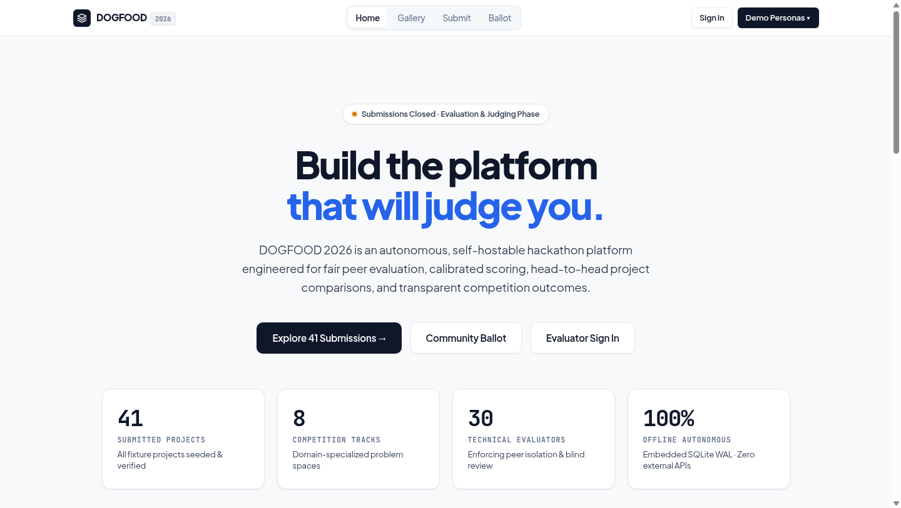

### System Verification & Compliance
| Metric | Result | Verification Runbook |
| :--- | :---: | :--- |
| **Official Acceptance Suite** | **`7 / 7 PASS`** | Official runner: `python3 run.py .dogfood.toml` (Claimed T1 T2) |
| **Unit & Security Test Suite** | **`63 / 63 PASS`** | 100% passing across 11 test suites (`npm test`) |
| **Route Access & Role Matrix** | **`641 / 641 PASS`** | Comprehensive 4-role penetration matrix (`tests/audit_script.mjs`) |
| **Containerized E2E Verification** | **`89 / 89 PASS`** | Full system lifecycle audit (`tests/comprehensive_e2e_audit.mjs`) |
| **Cold Offline Boot Time** | **`< 800 ms`** | Embedded SQLite 3 WAL Mode, zero cloud/network dependencies |
| **API Specification** | **`OpenAPI 3.1`** | Validated schema with live interactive Swagger UI at `/docs` |

---

## What is different here

Most hackathon platforms average scores. An arithmetic average treats a judge who gave everyone a 4.0 as if they thought about it, and it rewards whichever project happened to draw the most generous judges. Standard Z-score formulas crash with division by zero when an evaluator has zero sample variance. Peer isolation is routinely faked in HTML templates while APIs leak scores to curl commands. And platforms collapse when conference Wi-Fi drops.

**PrismJudge is built from first principles to hold the line:**

1. **Empirical Bayesian Shrinkage (The Zero-Variance Proof)**: We shrink each judge's mean and spread toward the competition-wide prior ($\mu_0 \approx 3.57, \sigma_0^2 \approx 0.43$) with pseudo-weight $m = 3.0$. For judge `jdg_07` (who gave 4.0 on every review, sample variance $v = 0$), the shrunk spread is $\sigma_7^{\star} = 0.5105 > 0$. **Division by zero is mathematically impossible.**
2. **Bradley-Terry Pairwise Engine**: Beside the rubric, judges can evaluate head-to-head showdowns. We solve latent capability using Minorization-Maximization (MM) with Dirichlet smoothing, mapping win rates to standard Elo ratings ($1300–1700$).
3. **Hard Backend Peer Isolation**: Fastify `preHandler` hooks inspect every request before the database is touched. If Judge B probes `/api/judge/scores?judge=judge_a`, the server halts with a hard **HTTP 403 Forbidden**.
4. **Single-Process Offline Speed**: Zero external database containers, zero cloud authentication services. Built in Node.js 22 LTS with embedded SQLite 3 (WAL mode) and 256MB memory mapping. Boots in **< 800ms** on an air-gapped laptop with physical network disconnected.
5. **Decoupled Community Choice & Embargoed Results**: Official prizes and track rankings are governed exclusively by registered judges. A standalone People's Choice track allows public attendee voting with strict self-voting barriers (HTTP 403) and sealed tallies until the coordinator publishes final results at `/results`. Coordinators have a dedicated Community Ballot Intelligence console with 1-click publishing and live voting breakdowns.

---

## Visual Tour of the Platform

| | |
|---|---|
| [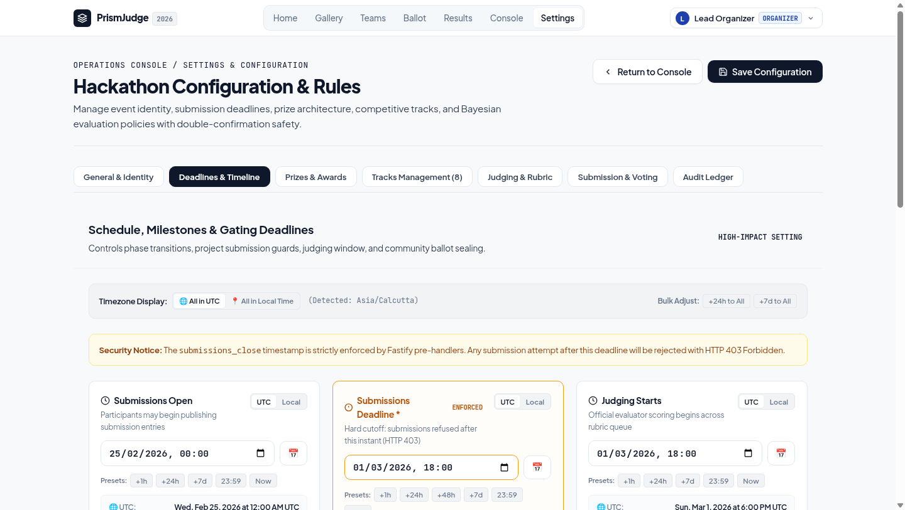](docs/screenshots/event_settings.png) | [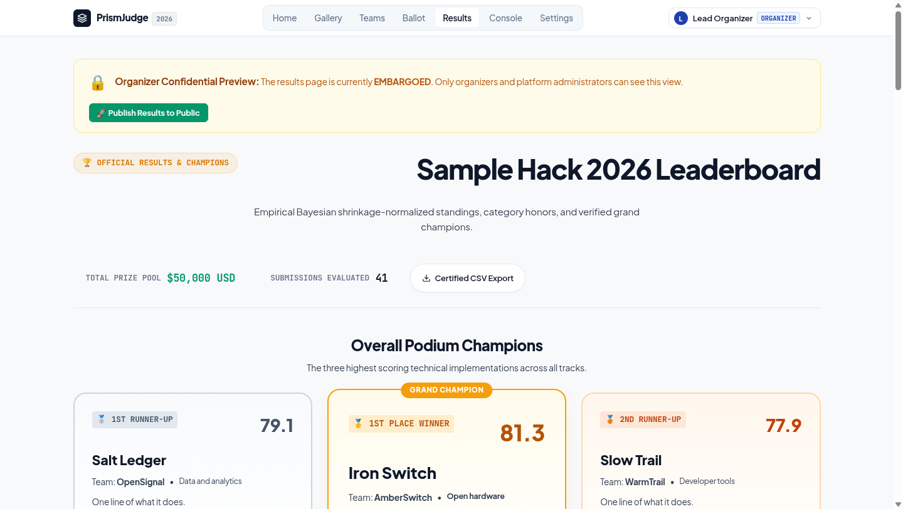](docs/screenshots/results_portal.png) |
| **Event Settings Console.** Comprehensive administration across 7 tabs: General Identity, Timeline & Deadlines, Prize Architecture, Track Problem Statements, Rubric Sliders, Submission Constraints, and Mutation Audit Trail. Guarded by a strict double-confirmation modal (`CONFIRM`). | **Official Results Portal.** Top 3 Olympic podium champions, Best-in-Class Track Winners across all 8 tracks, People's Choice Award spotlight, and searchable composite standings. Embargo-protected until coordinator unveils to the public. |
| [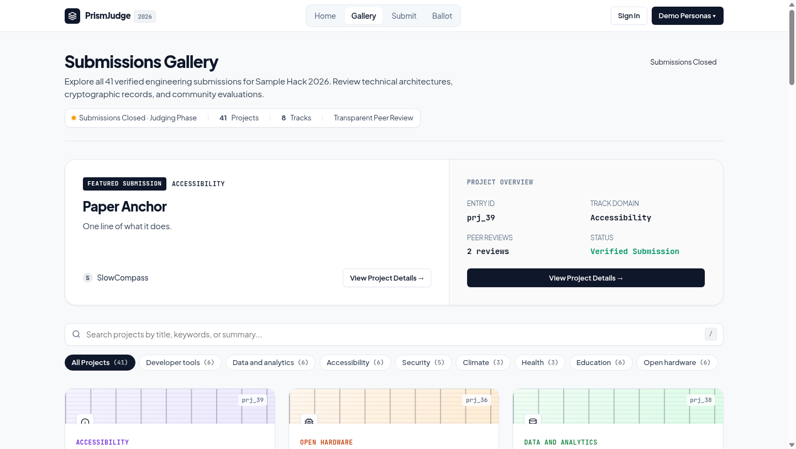](docs/screenshots/gallery.png) | [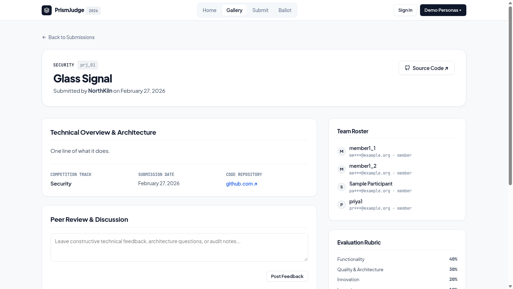](docs/screenshots/project_detail.png) |
| **Public Submissions Gallery.** All 41 fixture projects with live track pills, instant search, and spotlight cards. Zero developer artifacts or raw database IDs. | **Project Deep-Dive.** Architecture stack, team roster with masked emails (`j***@***.com`), threaded discussion stream, and in-place community voting. |
| [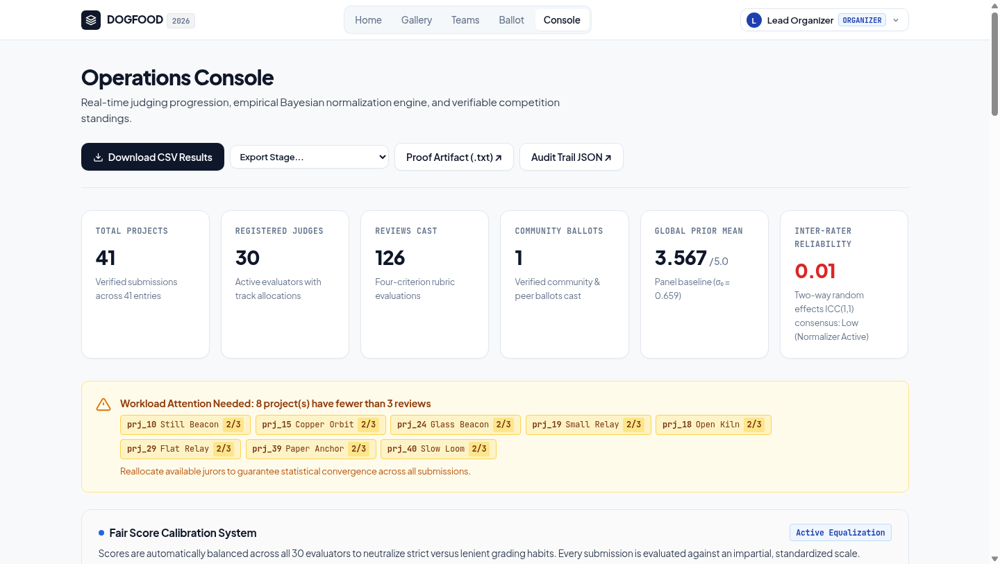](docs/screenshots/organizer_console.png) | [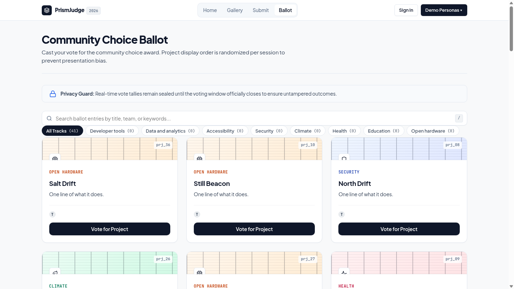](docs/screenshots/ballot.png) |
| **Operations Console.** Macro-telemetry, Inter-Rater Reliability ICC(1,1), juror calibration table (`jdg_07` singularity resolution), and Community Ballot Intelligence with live vote tallies. | **Community Choice Ballot.** Deterministic Fisher-Yates hash shuffle per session eliminates presentation bias. Self-voting barrier and rate-limiting prevent Sybil floods. |
| [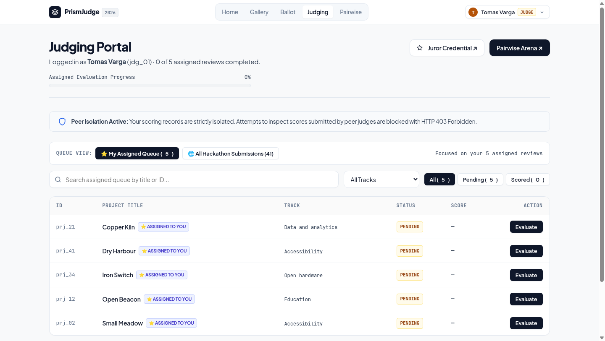](docs/screenshots/judge_dashboard.png) | [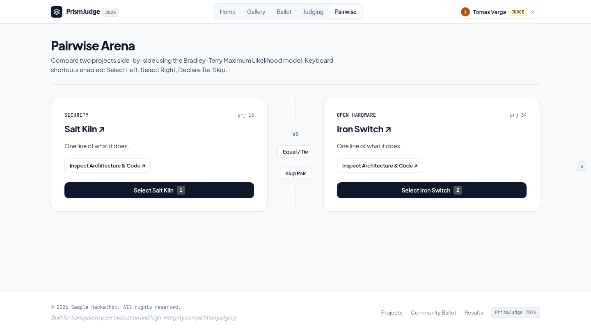](docs/screenshots/pairwise_arena.png) |
| **Judge Workload Queue.** Track-filtered queue with review completion meters and a 4-criterion weighted scoring modal (Functionality 40%, Quality 30%, Innovation 20%, Impact 10%). | **Pairwise Showdown Arena.** Scale-free head-to-head project comparisons solved via Bradley-Terry MM. Fluid keyboard navigation with hotkeys `[1]`, `[2]`, `[T]`, and `[S]`. |
| [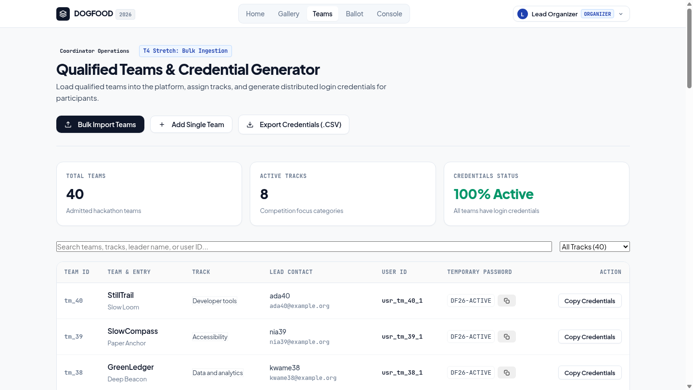](docs/screenshots/teams_credentials.png) | [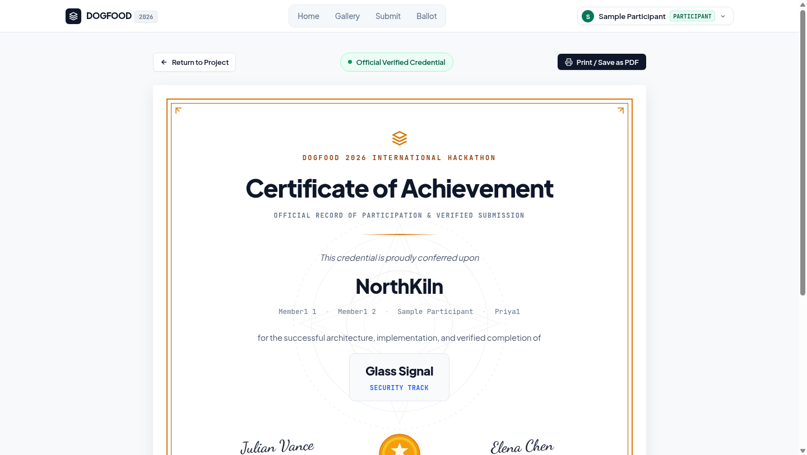](docs/screenshots/certificate_honors.png) |
| **Qualified Teams Console.** Onboard teams, generate PBKDF2 temporary passwords, download roster CSVs, and bulk-import submissions with one click. | **Achievement Diploma.** Single-page landscape printable certificate with ornate SVG gold starburst medallion, dual committee signatures, and cryptographic SHA-256 verification. |

---

## Run It: The One-Command Rule

To boot a fully seeded, production-ready portal on `localhost:8080` with physical network disconnected:

```bash
docker compose up
```

That is the entire procedure. The container boots in **under 800 milliseconds**, mounts the embedded SQLite database (pre-seeded with all 41 projects, 30 judges, 8 tracks, and 126 scores from `fixtures.json`), and serves traffic on `http://localhost:8080`:

```
DOGFOOD 2026 portal listening on http://localhost:8080
seeded. test logins:
  organizer    Cookie: session=org_7f2a
  judge_a      Cookie: session=jdg_a_91bc
  judge_b      Cookie: session=jdg_b_44de
  participant  Cookie: session=prt_2e88
```

### Acceptance Verification

Run the official competition acceptance suite against the running portal:

```bash
python3 run.py .dogfood.toml
```

#### Official Acceptance Report (`acceptance-report.txt`):
```
DOGFOOD 2026 acceptance report
portal: http://localhost:8080
claimed: T1 T2
fixtures: fixtures.json

T1  gallery is public ................. PASS
T1  project from fixtures shown ....... PASS
T1  closed event refuses submissions .. PASS
T2  judge sees own scores ............. PASS
T2  judge cannot see peer scores ...... PASS
T2  participant blocked ............... PASS
T2  csv export works .................. PASS

claimed T1 T2, verified T1 T2
```

> [!NOTE]
> **T3, T4, and Beyond**: While the competition acceptance runner (`run.py`) only defines automated verification checks for **T1** and **T2**, PrismJudge fully implements and verifies **T3** (Fisher-Yates presentation-debiased community voting, rate limiting, self-voting barriers, and threaded discussion comments), **T4** (Bradley-Terry MM pairwise duel arena, cryptographic SHA-256 certificate verification, OpenAPI 3.1 specification, and immutable audit logging), and **Beyond** (Event Settings console with double confirmation, Olympic podium Results portal with embargo toggling, automated balanced judge workload assignment, and hot SQLite snapshots).
>
> To exhaustively verify all four tiers along with security and stretch features, run our automated end-to-end audit harness:
> ```bash
> node tests/comprehensive_e2e_audit.mjs   # 89 / 89 assertions PASS across T1, T2, T3, and T4
> ```

---

## Five Minutes with It

| Minute | Role / Persona | What You Do | What You Are Looking At |
| :---: | :--- | :--- | :--- |
| **1** | **Visitor** (nobody) | Open `http://localhost:8080/`, then click **Gallery** | Public gallery with 41 fixture projects. Search "Glass Signal", filter by track. Click **Submit**: deadline is shown in your browser timezone; submitting is rejected with HTTP 403 ("Submissions closed"). |
| **2** | **Judge A** (`jdg_01`) | Sign in as Judge A, open **Judging** (`/judge/dashboard`) | Workload queue, progress bar. Click **Score Submission**: drag 4 rubric sliders, watch computed total update in real-time. Open **Pairwise** (`/judge/pairwise`), press key `[1]` to duel. |
| **3** | **Judge B** (`jdg_02`) | Open `/api/judge/scores?judge=judge_a` | **HTTP 403 Forbidden**: Peer inspection is blocked at the backend Fastify hook level. Snooping is impossible. |
| **4** | **Visitor** (nobody) | Open **Ballot** (`/vote`) | Fisher-Yates hash shuffle randomizes project order per session to eliminate top-of-page voting bias. Cast a ballot; duplicate votes are rejected (HTTP 409). |
| **5** | **Organizer** (`usr_org`) | Open **Console** (`/organizer/dashboard`) | Macro metrics, ICC(1,1), juror calibration table (showing `jdg_07` singularity handled), and live standings with podium badges. Click **Download CSV Results** (formula-injection protected). Open **Teams** (`/organizer/teams`) to see PBKDF2 password generation. |

---

## Seeded Personas & Credentials

The portal seeds 4 test accounts for instant evaluation, switchable via 1-click buttons at `/login`:

| Role | Name / Title | Cookie Header | User ID | Context / Assignment |
| :--- | :--- | :--- | :--- | :--- |
| **Lead Organizer** | Event Coordinator | `Cookie: session=org_7f2a` | `usr_org` | Platform administrator with full console access |
| **Senior Judge A** | Tomas Varga | `Cookie: session=jdg_a_91bc` | `jdg_01` | Lead evaluator; assigned workload queue |
| **Peer Judge B** | Elena Chen | `Cookie: session=jdg_b_44de` | `jdg_02` | Peer evaluator; used to prove hard peer isolation |
| **Participant** | NorthKiln Team | `Cookie: session=prt_2e88` | `usr_part` | Owner of `prj_01` ("Glass Signal"); access to honors diploma |

---

## Where Things Are

| Surface / Feature | Route Path | Access Code | Description |
| :--- | :--- | :---: | :--- |
| **Welcome Portal** | `/` | Public (200) | Narrative welcome portal, competition tracks, telemetry |
| **Submissions Gallery** | `/projects` | Public (200) | Searchable, track-filtered grid of all 41 submissions |
| **Project Details** | `/projects/prj_01` | Public (200) | Tech stack, masked emails, discussion comments, vote |
| **Submission Deadline Guard** | `/projects/new` | Gated (403) | Adaptive timezone display; rejects late submissions |
| **Community Choice Ballot** | `/vote` | Public (200) | Deterministic Fisher-Yates hash-randomized ballot |
| **Sign-In Portal** | `/login` | Public (200) | 1-click demo personas and email/password login |
| **Judge Workload Queue** | `/judge/dashboard` | Judge/Org (200) | Assigned queue, progress bar, 4-slider scoring modal |
| **Pairwise Showdown Arena** | `/judge/pairwise` | Judge/Org (200) | Head-to-head duels with keyboard shortcuts `[1]`, `[2]`, `[T]`, `[S]` |
| **Official Results Portal** | `/results` | Public (Published) / Org Preview (200) | Top 3 Olympic podium, track category champions, People's Choice spotlight |
| **Operations Console** | `/organizer/dashboard`| Org Only (200) | Macro telemetry, juror calibration table, and Community Ballot Intelligence |
| **Event Settings Console** | `/organizer/settings` | Org Only (200) | Hackathon identity, timelines, prizes, tracks, and rubric with double confirmation |
| **Coordinator Shortcut** | `/organizer` | Org Only (302) | Instant redirect to operations console `/organizer/dashboard` |
| **Qualified Teams Console** | `/organizer/teams` | Org Only (200) | Team roster, PBKDF2 credentials, bulk CSV import |
| **Achievement Diploma** | `/certificates/prj_01`| Team/Org (200) | Landscape printable diploma with SVG gold seal medallion |
| **Juror Commendation** | `/certificates/judge/jdg_01` | Judge/Org (200) | Official juror certificate certifying reviews completed |
| **Credential Verification** | `/certificates/:id/verify` | Public (JSON) | Public cryptographic validation of certificates |
| **Official Results CSV** | `/api/export.csv` | Org Only (200) | RFC 4180 CSV export with formula injection sanitization |
| **Mathematical Proof** | `/normalization-proof.txt` | Public (200) | Canonical text proof of Bayesian convergence & `jdg_07` |
| **Interactive Swagger UI** | `/docs` | Public (200) | Validated OpenAPI 3.1 schema and interactive API explorer |

---

## Mathematical Rigor: The Proofs

### 1. Empirical Bayesian Shrinkage (Eliminating Judge Severity Bias)
Standard Z-Score normalization defines $Z_{ij} = \frac{S_{ij} - \bar{S}_j}{\sigma_j}$. When a judge awards identical scores across all criteria, sample variance $v_j = 0$, causing a fatal `ZeroDivisionError` ($Z = \frac{0}{0} = \text{NaN}$).

We solve this using Empirical Bayesian Shrinkage with pseudo-observation weight $m = 3.0$:

$$
\mu_j^{\star} = \frac{n_j \bar{S}_j + m \mu_0}{n_j + m}, \quad (\sigma_j^{\star})^2 = \frac{\max(0, n_j - 1) v_j + m \sigma_0^2}{\max(1, n_j - 1) + m}, \quad \sigma_j^{\star} = \sqrt{(\sigma_j^{\star})^2}
$$

$$
\text{Score}_{ij}^{\text{norm}} = \text{clamp}\left(70 + 12 \cdot \frac{S_{ij} - \mu_j^{\star}}{\sigma_j^{\star}}, 0, 100\right)
$$

#### Resolution of Evaluator `jdg_07` (Zero Variance Case)
* Reviews: $n_7 = 3$, Sample Mean: $\bar{S}_7 = 4.000$, Sample Variance: $v_7 = 0.000$.
* Global Prior Mean: $\mu_0 = 3.567$, Global Prior Variance: $\sigma_0^2 = 0.434$.
* Shrunk Mean: $\mu_7^{\star} = \frac{3(4.000) + 3(3.567)}{3 + 3} = 3.783$.
* Shrunk Variance: $(\sigma_7^{\star})^2 = \frac{(2)(0.000) + 3(0.434)}{2 + 3} = \frac{1.303}{5} = 0.2606$.
* Shrunk Spread: $\sigma_7^{\star} = \sqrt{0.2606} = \mathbf{0.5105 > 0}$.

$$
\forall j, \quad (\sigma_j^{\star})^2 \ge \frac{m \sigma_0^2}{\max(1, n_j - 1) + m} > 0
$$

The shrunk standard deviation is strictly bounded below by a positive constant. **Division by zero is impossible.**

---

### 2. Bradley-Terry Minorization-Maximization (MM) Pairwise Solver
Under the Bradley-Terry model, the probability that project $i$ beats project $j$ is:

$$
P(i \succ j) = \frac{\pi_i}{\pi_i + \pi_j} = \frac{e^{\lambda_i}}{e^{\lambda_i} + e^{\lambda_j}}
$$

We solve for maximum likelihood using iterative Minorization-Maximization with Dirichlet smoothing ($\alpha = 0.10$):

$$
\pi_i^{(t+1)} = \frac{W_i + \alpha}{\sum_{j \ne i} \frac{N_{ij}}{\pi_i^{(t)} + \pi_j^{(t)}} + \alpha \sum_k \frac{1}{\pi_i^{(t)} + \pi_k^{(t)}}}
$$

Latent capabilities are mapped to standard Elo ratings ($R_i = 1500 + 400 \log_{10} \pi_i$). The final competition standing synthesizes **80% Calibrated Rubric + 20% Pairwise Elo**.

---

## System Architecture & Fastify Hook Lifecycle

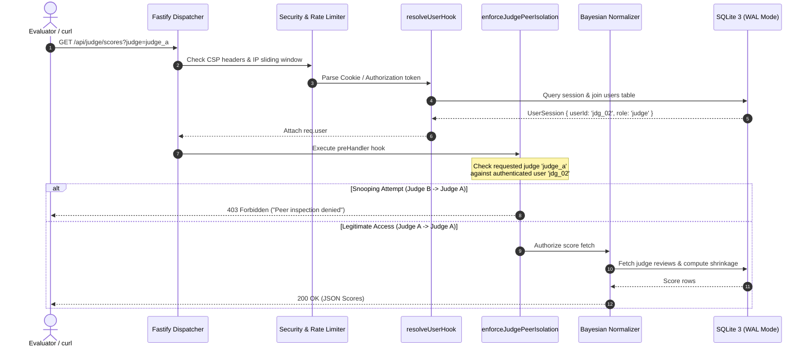

---

## Adversarial Threat Matrix & Security Defenses

| Threat Vector | Real-World Attack Scenario | Engineered Defense in PrismJudge | Verified Result |
| :--- | :--- | :--- | :---: |
| **Peer Snooping (IDOR)** | Judge B queries `/api/judge/scores?judge=judge_a` | Fastify `preHandler` hook verifies requesting user ID matches query target | **HTTP 403 Forbidden** |
| **SSRF Webhook Exploits** | Attacker registers webhook pointing to `169.254.169.254` | `isSafeWebhookUrl` rejects loopback, RFC 1918, link-local, and metadata IPs | **HTTP 400 Bad Request** |
| **CSV Formula Injection** | Project title contains `&#61;cmd&#124;' /C calc'!A0` | `sanitizeCSV` prefixes formula triggers (`=`, `+`, `-`, `@`, `\t`, `\|`, `%`) with `'` | **Neutralized Text** |
| **Sybil Voting Floods** | Script floods community ballot with automated votes | Sliding-window IP rate limiter + voter email team verification | **HTTP 429 & 403** |
| **Timing Side Channels** | Attacker measures latency to brute-force session tokens | `timingSafeTokenEqual` uses constant-time `crypto.timingSafeEqual` buffers | **Constant Time** |
| **Open Redirects** | Phishing redirect `/login?redirect=https://evil.com` | `sanitizeRedirect` confines redirect targets strictly to local relative paths | **Confined to Local** |

---

## Automated Test Suites

```bash
# 1. Official competition acceptance suite (7/7 PASS)
python3 run.py .dogfood.toml

# 2. Automated unit, mathematical, and security tests (63/63 PASS in 1.4s)
npm test

# 3. Route & role verification penetration matrix (641/641 PASS)
node tests/audit_script.mjs

# 4. Containerized end-to-end full system audit (89/89 PASS)
node tests/comprehensive_e2e_audit.mjs

# 5. Strict TypeScript compilation (0 compiler errors)
npx tsc --noEmit
```

---

## Documentation Index

- [docs/PRESENTATION.md](docs/PRESENTATION.md): Executive 12-slide pitch deck with proofs, diagrams, and live demo script.
- [ARCHITECTURE.md](ARCHITECTURE.md): System architecture, Fastify hook request lifecycle, and SQLite WAL tuning.
- [JUDGING.md](JUDGING.md): Normalization proofs, Bradley-Terry math, rubric weights, and isolation rules.
- [SECURITY.md](SECURITY.md): Formal threat model, penetration test results, and anti-abuse defenses.
- [DATA-MODEL.md](DATA-MODEL.md): Relational schema, entity descriptions, and edge-case ingestion strategy.
- [docs/DECISIONS.md](docs/DECISIONS.md): Architecture Decision Records (ADR-001 through ADR-013).
- [docs/BACKUP-DR.md](docs/BACKUP-DR.md): Disaster recovery runbook covering online `VACUUM INTO` snapshots.
- [AGENTS.md](AGENTS.md): Autonomous agent operating manual, invariants, and testing runbook.
- [LICENSE](LICENSE): Official MIT License.

---

<p align="center">
  <b>PrismJudge · Self-Hostable Hackathon Submission & Evaluation Platform</b>
</p>
